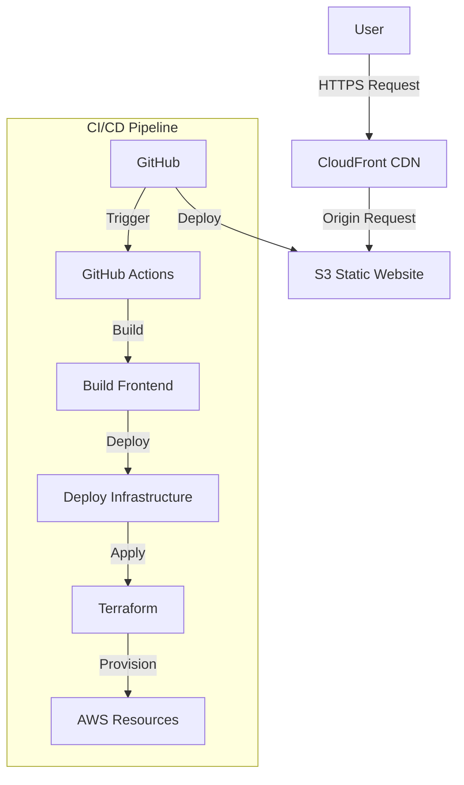

```mermaid
graph TD
    User -->|HTTPS Request| CloudFront[CloudFront CDN]
    CloudFront -->|Origin Request| S3[S3 Static Website]
    GitHub -->|Deploy| S3

    subgraph CI/CD Pipeline
        GitHub -->|Trigger| Actions[GitHub Actions]
        Actions -->|Build| Build[Build Frontend]
        Build -->|Deploy| Deploy[Deploy Infrastructure]
        Deploy -->|Apply| Terraform[Terraform]
        Terraform -->|Provision| AWS[AWS Resources]
    end
```
